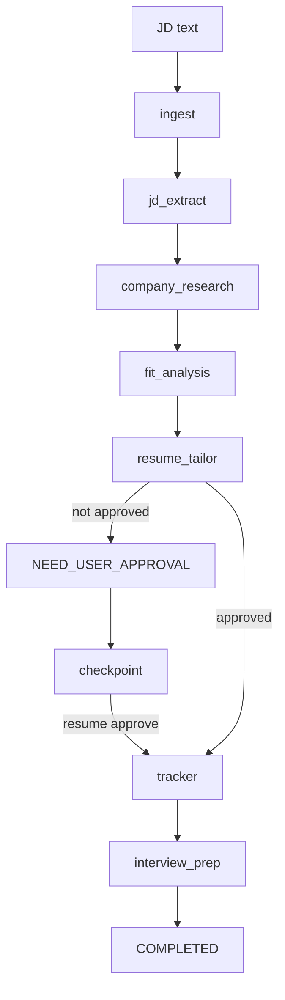

# Multi-Agent Job Search Platform

Reference implementation for a multi-agent job-search platform.

This repo is intentionally a learning codebase first. It demonstrates the operating pattern behind a production agent system without requiring API keys or network access:

- supervisor-style graph orchestration
- typed shared state
- bounded agent nodes
- human-in-the-loop stop reasons
- local JSONL tracing
- offline evals
- application tracker write after approval
- an MCP-shaped tool boundary

The production design lives in [TECHNICAL_DESIGN.md](TECHNICAL_DESIGN.md).
The guided code-reading path lives in [docs/LEARNING_GUIDE.md](docs/LEARNING_GUIDE.md).
Chinese HTML docs are available at [docs/usage_zh.html](docs/usage_zh.html), [docs/architecture_zh.html](docs/architecture_zh.html), and [docs/project1_ai_infra_tutorial_zh.html](docs/project1_ai_infra_tutorial_zh.html).

The Project 1 AI infra tutorial explains how this zero-cost reference implementation maps to the original LangGraph, MCP, Langfuse, pgvector, eval, and deployment plan, including what is implemented now, what remains missing, and which next steps may require paid APIs or hosted accounts.

## Quickstart

Run the workflow until the resume proposal approval gate:

```bash
python3 -m jobagent.cli demo
```

Resume a paused run after reviewing the generated proposal:

```bash
python3 -m jobagent.cli resume <run_id> --approve
```

Run the full workflow and write a local tracker event:

```bash
python3 -m jobagent.cli demo --auto-approve
```

Run offline evals:

```bash
python3 -m jobagent.cli eval
```

Run tests:

```bash
python3 -m unittest discover -s tests
```

Local runtime artifacts are written under `.jobagent/` and ignored by git:

- `.jobagent/checkpoints/<run_id>.json`
- `.jobagent/runs/<run_id>/trace.jsonl`
- `.jobagent/applications.jsonl`

## How To Read The Code

Start here:

- [jobagent/models.py](jobagent/models.py): shared state, artifacts, and `StopReason`.
- [jobagent/graph/engine.py](jobagent/graph/engine.py): small graph runner that mirrors the LangGraph mental model.
- [jobagent/graph/workflow.py](jobagent/graph/workflow.py): node wiring.
- [jobagent/agents/](jobagent/agents): bounded agent responsibilities.
- [jobagent/storage/checkpoint.py](jobagent/storage/checkpoint.py): local checkpoint/resume store for HITL.
- [jobagent/llm/provider.py](jobagent/llm/provider.py): provider interface for future Anthropic/OpenAI adapters.
- [jobagent/prompts/registry.py](jobagent/prompts/registry.py): prompt version registry.
- [jobagent/evals/runner.py](jobagent/evals/runner.py): offline eval harness.
- [jobagent/observability/tracer.py](jobagent/observability/tracer.py): local JSONL trace sink.
- [mcp_server/career_research_server.py](mcp_server/career_research_server.py): dependency-free MCP-shaped teaching stub.

## Architecture



## Why The Code Uses No External Dependencies Yet

The first teaching milestone should always run. This version uses standard-library Python to make the core agent architecture visible:

- graph state instead of hidden framework state
- clear node boundaries
- explicit stop reasons
- checkpoint/resume before and after human approval
- provider and prompt boundaries
- testable deterministic behavior
- trace files you can inspect directly

The intended production migration is:

- replace `GraphEngine` with LangGraph `StateGraph`
- replace local JSONL tracing with Langfuse/OpenTelemetry callbacks
- replace heuristic nodes with Anthropic/OpenAI structured-output calls
- replace JSONL tracker with Postgres plus optional Notion/Google Sheets MCP
- replace the teaching MCP stub with the official MCP Python SDK

## Example Output Shape

The demo prints:

- run id
- stop reason
- company and role
- fit score
- resume proposal
- optional tracker update and interview pack
- trace path

When `--auto-approve` is omitted, the workflow stops at `NEED_USER_APPROVAL`. That is deliberate: resume/application material should not become final without human review.
