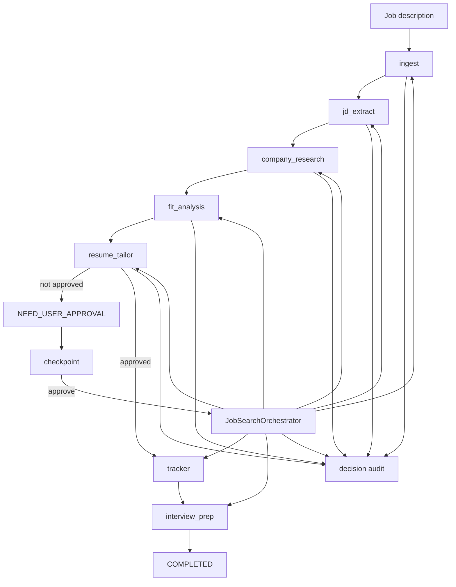

# JobAgent

[中文版本](README.zh.md)


**A production-shaped multi-agent job-search cockpit.**

JobAgent turns a job description into structured role signals, company research, fit analysis, resume-positioning suggestions, a human approval checkpoint, a tracker update, and interview prep. It is designed to be useful as a small product, but its real value is that it makes modern agent-system engineering visible: typed shared state, bounded agents, human-in-the-loop control, checkpoint/resume, evals, traces, guardrails, deployment, and optional production-stack integrations.

The default path is intentionally deterministic and low-cost. You can run the product, tests, and evals without API keys, hosted embeddings, managed databases, or fragile external scraping. Once the core system is understandable, the repo shows where to plug in LangGraph, LLM providers, MCP tools, Langfuse, Postgres, and pgvector.

- **Live product:** [https://jobagent-demo.onrender.com](https://jobagent-demo.onrender.com)

## What This Shows

| Signal | Evidence in this repo |
| --- | --- |
| Multi-agent orchestration | A control-plane orchestrator routes bounded agent nodes through registered tool boundaries. |
| Typed product frontend | React and TypeScript render the cockpit while FastAPI keeps workflow authority on the server. |
| Product judgment | The workflow stops at `NEED_USER_APPROVAL` before application-facing side effects. |
| Durable execution mindset | Checkpoints each run before the human gate and resumes from the pending node after approval. |
| Agent observability | Every run records orchestrator decisions, tool audit events, JSONL traces, and per-run quality checks. |
| Eval-first engineering | Offline workflow evals and retrieval-level RAG evals protect behavior from silent drift. |
| Public demo hardening | Request limits, form-only submissions, guardrails, browser security headers, request ids, rate limits, and creator-session approval. |
| Production upgrade path | Optional adapters cover LangGraph, Claude/OpenAI providers, Langfuse, MCP, Postgres, pgvector, Docker, and Render. |

## Product Narrative

JobAgent is built for two readers at once: job seekers who want a trustworthy application-prep cockpit, and engineers who want to see how agent systems become products. The user pain is not "I need another chatbot." It is that job-search work crosses messy boundaries: extracting role signals, deciding whether a resume angle is credible, preserving evidence, and stopping before anything application-facing becomes final.

The design rationale is therefore a workflow cockpit, not an open-ended chat box. The backend keeps authority over state, approval, checkpoints, traces, and evals; the web layer makes those decisions visible to a user. The current frontend keeps that split explicit: React and TypeScript own the interactive cockpit under `jobagent/web/frontend/*`, built assets are served from `jobagent/web/static/assets/*`, and Jinja templates shrink to React mount points.

Good is defined by eval, not by how polished a single generated answer sounds. A run is good when it reaches the expected trajectory and `StopReason`, extracts the right JD signals, preserves the human approval gate, keeps retrieval evidence checkable, and produces the required artifacts for the UI. That is why workflow evals, retrieval evals, and per-run quality summaries all matter.

## Product Experience


The hosted UI is a typed React cockpit: run status, agent workflow, bounded specialist roster, recent activity, approval state, eval summary, and the command form live on one operating surface.

1. Paste a job description.
2. Let bounded agent nodes analyze the role.
3. Pause before resume or tracker output becomes final.
4. Approve the generated proposal.
5. Continue into tracker and interview-prep outputs.


## Architecture



The important design choice is that the agents are not free-floating chat roles. Each node owns a narrow slice, reads and writes a typed `JobSearchState`, and runs only after `JobSearchOrchestrator` records whether the system should run, stop, block, or ask a human.

## Quickstart

Set up a local editable install:

```bash
python3 -m venv .venv
source .venv/bin/activate
python3 -m pip install -e .
```

Run the workflow until the resume proposal approval gate:

```bash
python3 -m jobagent.cli demo
```

Resume a paused run after reviewing the proposal:

```bash
python3 -m jobagent.cli resume <run_id> --approve
```

Run the full workflow and write a local tracker event:

```bash
python3 -m jobagent.cli demo --auto-approve
```

Run the web product locally:

```bash
uvicorn jobagent.web.app:app --reload
```

Then open <http://localhost:8000>.

## Verification

| Command | What it proves |
| --- | --- |
| `python3 -m unittest discover -s tests` | Workflow behavior, web safety controls, eval runner, retrieval, optional integration contracts. |
| `python3 -m jobagent.cli eval` | 15-case offline regression suite for trajectory and JD extraction behavior. |
| `python3 -m jobagent.cli retrieval-eval` | 3-case retrieval suite with recall, precision, MRR, prohibited-hit, and freshness checks. |
| `python3 -m jobagent.cli demo --auto-approve` | End-to-end run through tracker and interview prep, including trace and checkpoint artifacts. |
| `curl http://localhost:8000/healthz` | Web process liveness for local and Render smoke checks. |
| `curl http://localhost:8000/readyz` | Storage readiness and run-store health. |

Local runtime artifacts are written under `.jobagent/` and ignored by git:

```text
.jobagent/checkpoints/<run_id>.json
.jobagent/runs/<run_id>/trace.jsonl
.jobagent/applications.jsonl
```

## Code Map

| Area | Start here | Why it matters |
| --- | --- | --- |
| Shared state | [jobagent/models.py](jobagent/models.py) | Defines `JobSearchState`, artifacts, stop reasons, retrieval contexts, eval summaries, and audit records. |
| Graph runtime | [jobagent/graph/engine.py](jobagent/graph/engine.py), [jobagent/graph/workflow.py](jobagent/graph/workflow.py) | Runs the deterministic teaching graph and handles checkpoint/resume behavior. |
| Control plane | [jobagent/orchestration/controller.py](jobagent/orchestration/controller.py) | Decides whether each node can run, should stop, or needs human approval. |
| Bounded agents | [jobagent/agents/](jobagent/agents) | Implements ingestion, JD extraction, company research, fit analysis, resume tailoring, tracker update, and interview prep. |
| Tool boundaries | [jobagent/tools/registry.py](jobagent/tools/registry.py) | Registers node capabilities and emits tool audit events. |
| Retrieval | [jobagent/retrieval/local_rag.py](jobagent/retrieval/local_rag.py), [jobagent/retrieval/eval_runner.py](jobagent/retrieval/eval_runner.py) | Builds local RAG context with citations, freshness metadata, and retrieval-specific evals. |
| Evals | [jobagent/evals/runner.py](jobagent/evals/runner.py), [jobagent/evals/run_quality.py](jobagent/evals/run_quality.py) | Runs offline eval suites and summarizes per-run quality for the UI. |
| Web product | [jobagent/web/app.py](jobagent/web/app.py), [jobagent/web/store.py](jobagent/web/store.py) | FastAPI web shell, safety controls, local/Postgres run stores, and ops endpoints. |
| Frontend cockpit | [jobagent/web/frontend/main.tsx](jobagent/web/frontend/main.tsx), [jobagent/web/frontend/styles.css](jobagent/web/frontend/styles.css) | React/TypeScript UI state, run timeline rendering, approval controls, eval summaries, and responsive product styling. |
| Guardrails | [jobagent/security/input_guardrails.py](jobagent/security/input_guardrails.py) | Rejects secret-shaped and prompt-injection-shaped public submissions before workflow execution. |
| Optional stack | [jobagent/integrations/registry.py](jobagent/integrations/registry.py) | Documents upgrade paths for LangGraph, LLM providers, Langfuse, MCP, Postgres, pgvector, and Docker. |
| MCP boundary | [mcp_server/career_research_server.py](mcp_server/career_research_server.py), [mcp_server/career_research_sdk_server.py](mcp_server/career_research_sdk_server.py) | Shows both a dependency-free MCP-shaped boundary and an SDK-backed server path. |

## Web And Deployment

This repo includes a Render Blueprint at [render.yaml](render.yaml). The hosted demo deploys one Docker web service:

| Service | Setting |
| --- | --- |
| `jobagent-demo` | Runs `uvicorn jobagent.web.app:app` from the Docker image. |
| Health check | `/healthz` |
| Public demo flag | `JOBAGENT_PUBLIC_DEMO_MODE=true` |

[Deploy to Render](https://render.com/deploy?repo=https://github.com/yanxuantong/multi-agent-job-search-platform)

The public Render demo intentionally keeps the surface bounded. It uses local checkpoint-backed run state unless `JOBAGENT_DATABASE_URL` is set, so run history should be treated as ephemeral on the free instance. In non-public mode, `/ops/evals` can run the bundled regression suite as an operational smoke check. In public demo mode, that endpoint is hidden.

Frontend source lives in [jobagent/web/frontend](jobagent/web/frontend). Built assets are committed under [jobagent/web/static/assets](jobagent/web/static/assets) so the Docker/Render service can serve the product without a Node runtime in production. After UI edits, run:

```bash
npm run check:frontend
```

For a more production-like deployment, add Render Postgres or use the local [docker-compose.yml](docker-compose.yml) stack, then set `JOBAGENT_DATABASE_URL` to the private connection string. The app automatically switches from `LocalRunStore` to `PostgresRunStore`.

## Safety Boundaries

The public workflow is constrained by design:

- It does not call external LLM APIs by default.
- It does not execute user-provided code.
- It does not fetch arbitrary job URLs.
- It requires `application/x-www-form-urlencoded` submissions for run creation.
- It enforces request and job-description size limits.
- It rate-limits `/runs` by client.
- It rejects obvious secrets, credentials, private keys, and instruction-override prompts.
- It validates run ids before store lookup.
- It binds run approval to the creator browser session.
- It returns baseline browser security headers and request ids.

These controls make the hosted product appropriate for portfolio/public-demo traffic. They do not make the free instance a high-availability SaaS. The next production steps would be authentication, durable Postgres by default, queue-backed workers, stronger edge rate limiting, abuse monitoring, source-grounded company research, and final-answer grounding evals.

## Optional Production-Stack Paths

| Stack item | Code entrypoint | Install hint | Cost note |
| --- | --- | --- | --- |
| Local RAG | [jobagent/retrieval/local_rag.py](jobagent/retrieval/local_rag.py), [jobagent/retrieval/eval_runner.py](jobagent/retrieval/eval_runner.py) | Built in; run `python3 -m jobagent.cli retrieval-eval` | Local keyword retrieval is free; hosted embeddings or rerankers may cost money. |
| LangGraph | [jobagent/graph/langgraph_reference.py](jobagent/graph/langgraph_reference.py) | `python3 -m pip install -e '.[langgraph]'` | Local library is free; production checkpointers may need Postgres. |
| Claude/OpenAI SDKs | [jobagent/llm/anthropic_provider.py](jobagent/llm/anthropic_provider.py), [jobagent/llm/openai_provider.py](jobagent/llm/openai_provider.py) | `python3 -m pip install -e '.[llm]'` | API usage is usually billed per token. |
| Langfuse | [jobagent/observability/langfuse_exporter.py](jobagent/observability/langfuse_exporter.py) | `python3 -m pip install -e '.[observability]'` | Self-host can be free; hosted tiers may be paid. |
| Postgres/pgvector | [jobagent/storage/postgres_memory.py](jobagent/storage/postgres_memory.py), [docker-compose.yml](docker-compose.yml) | `docker compose up postgres -d` | Local Docker is free; managed databases are paid. |
| External MCP consumer | [jobagent/integrations/external_mcp_tracker.py](jobagent/integrations/external_mcp_tracker.py) | Connect after choosing Notion or Sheets MCP credentials | Workspace features may cost money. |
| MCP SDK server | [mcp_server/career_research_sdk_server.py](mcp_server/career_research_sdk_server.py) | `python3 -m pip install -e '.[mcp]'` | SDK is free; connected tools may have API costs. |
| Docker | [Dockerfile](Dockerfile), [docker-compose.yml](docker-compose.yml) | `docker compose run --rm app` | Local Docker is free; cloud deploy may require billing. |
