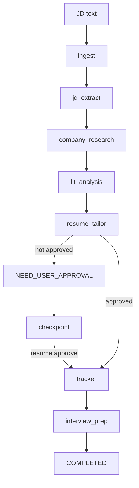

# Multi-Agent Job Search Platform

Reference implementation for a multi-agent job-search platform.

This repo is intentionally a learning codebase first. It demonstrates the operating pattern behind a production agent system without requiring API keys or network access for the default mock workflow:

- supervisor-style graph orchestration
- typed shared state
- bounded agent nodes
- human-in-the-loop stop reasons
- local JSONL tracing
- offline evals
- application tracker write after approval
- an MCP-shaped tool boundary
- a minimal FastAPI web demo for production-style deployment

The canonical learning guide lives in [docs/project1_ai_infra_tutorial_zh.html](docs/project1_ai_infra_tutorial_zh.html).

That single HTML guide consolidates the previous technical design, usage guide, learning guide, architecture notes, and Project 1 AI infra tutorial. It explains how this zero-cost reference implementation maps to the original LangGraph, MCP, Langfuse, pgvector, eval, and deployment plan, including what is implemented now, what remains missing, and which next steps may require paid APIs or hosted accounts.

## Quickstart

Run the workflow until the resume proposal approval gate:

```bash
python3 -m jobagent.cli demo
```

Resume a paused run after reviewing the generated proposal:

```bash
python3 -m jobagent.cli resume <run_id> --approve
```

Run the full workflow and write a local tracker event:

```bash
python3 -m jobagent.cli demo --auto-approve
```

Run offline evals:

```bash
python3 -m jobagent.cli eval
```

The sample suite contains 15 cases and reports both single-turn extraction evals and full trajectory evals.

Run tests:

```bash
python3 -m unittest discover -s tests
```

Inspect the optional production-stack learning paths:

```bash
python3 -m jobagent.cli integrations
```

Run the minimal web demo locally:

```bash
uvicorn jobagent.web.app:app --reload
```

Open <http://localhost:8000>, paste a job description, and approve the paused run from the result page.

Local runtime artifacts are written under `.jobagent/` and ignored by git:

- `.jobagent/checkpoints/<run_id>.json`
- `.jobagent/runs/<run_id>/trace.jsonl`
- `.jobagent/applications.jsonl`

When `JOBAGENT_DATABASE_URL` or `DATABASE_URL` is set, the web demo stores run state in Postgres instead of relying only on local checkpoint files.

## Render Deployment

This repo includes a Render Blueprint at [render.yaml](render.yaml). The Blueprint provisions:

- `jobagent-demo`: Docker web service running `uvicorn jobagent.web.app:app`
- `jobagent-postgres`: Render Postgres database used by the web run store

Deploy from Render by creating a new Blueprint from this GitHub repository. Render reads `render.yaml`, builds the Docker image, sets `JOBAGENT_DATABASE_URL` from the database connection string, and checks `/healthz`.

[Deploy to Render](https://render.com/deploy?repo=https://github.com/yanxuantong/multi-agent-job-search-platform)

## How To Read The Code

Start here:

- [jobagent/models.py](jobagent/models.py): shared state, artifacts, and `StopReason`.
- [jobagent/graph/engine.py](jobagent/graph/engine.py): small graph runner that mirrors the LangGraph mental model.
- [jobagent/graph/workflow.py](jobagent/graph/workflow.py): node wiring.
- [jobagent/agents/](jobagent/agents): bounded agent responsibilities.
- [jobagent/storage/checkpoint.py](jobagent/storage/checkpoint.py): local checkpoint/resume store for HITL.
- [jobagent/llm/provider.py](jobagent/llm/provider.py): provider interface for future Anthropic/OpenAI adapters.
- [jobagent/prompts/registry.py](jobagent/prompts/registry.py): prompt version registry.
- [jobagent/evals/runner.py](jobagent/evals/runner.py): offline eval harness.
- [jobagent/observability/tracer.py](jobagent/observability/tracer.py): local JSONL trace sink.
- [mcp_server/career_research_server.py](mcp_server/career_research_server.py): dependency-free MCP-shaped teaching stub.

## Architecture



## Why The Code Uses No External Dependencies Yet

The first teaching milestone should always run. This version uses standard-library Python to make the core agent architecture visible:

- graph state instead of hidden framework state
- clear node boundaries
- explicit stop reasons
- checkpoint/resume before and after human approval
- provider and prompt boundaries
- testable deterministic behavior
- trace files you can inspect directly

The intended production migration is:

- replace `GraphEngine` with LangGraph `StateGraph`
- replace local JSONL tracing with Langfuse/OpenTelemetry callbacks
- replace heuristic nodes with Anthropic/OpenAI structured-output calls
- replace JSONL tracker with Postgres plus optional Notion/Google Sheets MCP
- replace the teaching MCP stub with the official MCP Python SDK

## Optional Production-Stack Learning Paths

The default path stays zero-cost and dependency-free. The original Project 1 stack is represented through optional extras and code entrypoints:

| Stack item | Code entrypoint | Install hint | Cost note |
| --- | --- | --- | --- |
| Local RAG | `jobagent/retrieval/local_rag.py` | Built in | Local keyword retrieval is free; hosted embeddings/rerankers may cost money. |
| LangGraph | `jobagent/graph/langgraph_reference.py` | `python3 -m pip install -e '.[langgraph]'` | Local library is free; production checkpointers may need Postgres. |
| Claude/OpenAI SDKs | `jobagent/llm/anthropic_provider.py`, `jobagent/llm/openai_provider.py` | `python3 -m pip install -e '.[llm]'` | API usage is usually billed per token. |
| Langfuse | `jobagent/observability/langfuse_exporter.py` | `python3 -m pip install -e '.[observability]'` | Self-host can be free; hosted tiers may be paid. |
| Postgres/pgvector | `jobagent/storage/postgres_memory.py`, `docker-compose.yml` | `docker compose up postgres -d` | Local Docker is free; managed databases are paid. |
| External MCP consumer | `jobagent/integrations/external_mcp_tracker.py` | Connect after choosing Notion or Sheets MCP credentials | Local payload construction is free; workspace features may cost money. |
| MCP SDK server | `mcp_server/career_research_sdk_server.py` | `python3 -m pip install -e '.[mcp]'` | SDK is free; connected tools may have API costs. |
| Docker | `Dockerfile`, `docker-compose.yml` | `docker compose run --rm app` | Local Docker is free; cloud deploy may require billing. |

## Example Output Shape

The demo prints:

- run id
- stop reason
- company and role
- fit score
- resume proposal
- optional tracker update and interview pack
- trace path

When `--auto-approve` is omitted, the workflow stops at `NEED_USER_APPROVAL`. That is deliberate: resume/application material should not become final without human review.
