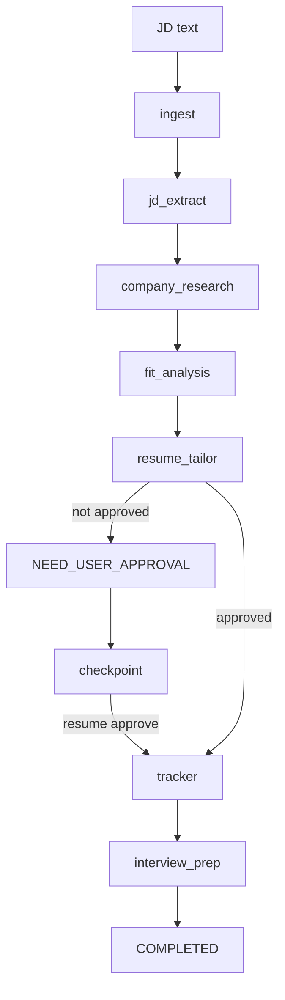

# Multi-Agent Job Search Platform

[中文版本](README.zh.md)

An agentic job-search product you can actually use.

This project is a learning-first reference implementation for a multi-agent job-search platform. It turns a job description into structured role signals, company research, fit analysis, resume-positioning suggestions, a human approval checkpoint, a tracker update, and interview prep.

The default path is intentionally deterministic and low-cost: no API keys, no hosted vector database, no fragile external calls. The point is to make the core production pattern visible before swapping in LangGraph, LLM providers, MCP tools, Langfuse, Postgres, or pgvector.

**Live product:** [https://jobagent-demo.onrender.com](https://jobagent-demo.onrender.com)

**Canonical learning guide:** [docs/project1_ai_infra_tutorial_zh.html](docs/project1_ai_infra_tutorial_zh.html)

## Product Snapshot


The hosted product now opens as a modern job-search cockpit: status cards, an agent workflow strip, bounded specialist roster, recent activity, and the command form live on one focused operating surface. The core loop is still intentionally simple:

1. Paste a job description.
2. Let bounded agent nodes analyze the role.
3. Pause before application-facing output becomes final.
4. Approve the resume proposal.
5. Continue into tracker and interview-prep outputs.


## What It Demonstrates

- **Supervisor-style orchestration:** a small graph engine coordinates bounded agent nodes.
- **Typed shared state:** all agents read/write a single `JobSearchState` model.
- **Human-in-the-loop control:** resume/application outputs stop at `NEED_USER_APPROVAL`.
- **Checkpoint and resume:** paused runs can continue after approval.
- **Offline evaluation:** deterministic eval cases protect the workflow from drift.
- **Traceability:** every run can write local JSONL traces.
- **Production surface:** FastAPI/Jinja UI, Dockerfile, Render deployment, safety limits, and optional Postgres store.
- **Learning bridge:** local teaching code maps cleanly to LangGraph, MCP, Langfuse, pgvector, and hosted LLM providers.

## Quickstart

Run the workflow until the resume proposal approval gate:

```bash
python3 -m jobagent.cli demo
```

Resume a paused run after reviewing the generated proposal:

```bash
python3 -m jobagent.cli resume <run_id> --approve
```

Run the full workflow and write a local tracker event:

```bash
python3 -m jobagent.cli demo --auto-approve
```

Run offline evals:

```bash
python3 -m jobagent.cli eval
```

Run tests:

```bash
python3 -m unittest discover -s tests
```

Run the web product locally:

```bash
uvicorn jobagent.web.app:app --reload
```

Then open <http://localhost:8000>.

## Render Deployment

This repo includes a Render Blueprint at [render.yaml](render.yaml). The hosted product deploys one Docker web service on Render's free web plan:

- `jobagent-demo`: runs `uvicorn jobagent.web.app:app`
- health check: `/healthz`
- public hosted mode flag: `JOBAGENT_PUBLIC_DEMO_MODE=true`

[Deploy to Render](https://render.com/deploy?repo=https://github.com/yanxuantong/multi-agent-job-search-platform)

The hosted product currently avoids managed Postgres so it can launch before adding billing details. In this mode, run state uses the local checkpoint store inside the web instance and should be treated as ephemeral. For a more production-like deployment, add a Render Postgres database and set `JOBAGENT_DATABASE_URL` to its private connection string; the app will automatically switch to the Postgres run store.

## Production Safety

The public service is intentionally constrained:

- request bodies and job descriptions have explicit size limits
- `/runs` has a lightweight per-client rate limit
- public submissions pass secret and prompt-injection guardrails before workflow execution
- run ids are validated before touching the checkpoint store
- form submissions must use `application/x-www-form-urlencoded`
- responses include baseline browser security headers: CSP, frame protection, no-sniff, referrer policy, and permissions policy
- every response gets an `X-Request-ID`, with `/readyz` and `/ops/status` for production smoke checks
- the default workflow does not call external LLM APIs, execute user-provided code, or fetch arbitrary job URLs

These controls do not make the free hosted instance a high-availability SaaS. They are meant to keep the public product safe enough for portfolio traffic while preserving a clean upgrade path to auth, durable Postgres state, queue-backed workers, and stronger edge rate limiting.

## Production Hardening Notes

This pass intentionally mirrors patterns from mainstream agent and workflow systems:

- **Durable execution mindset:** checkpoint every run before human approval, then resume from the pending node rather than replaying the whole workflow.
- **Guardrails before agency:** reject obvious secrets, credential-shaped payloads, and instruction-override prompts before any agent node runs.
- **Operational visibility:** expose `/healthz`, `/readyz`, `/ops/status`, request ids, and lightweight in-memory counters for smoke tests and incident triage.
- **Bounded public surface:** keep the default workflow deterministic, synchronous, and cost-free until auth, queues, durable Postgres, and budget tracking are added.

## Architecture



## How To Read The Code

Start with the core workflow:

- [jobagent/models.py](jobagent/models.py): shared state, artifacts, and `StopReason`.
- [jobagent/graph/engine.py](jobagent/graph/engine.py): small graph runner that mirrors the LangGraph mental model.
- [jobagent/graph/workflow.py](jobagent/graph/workflow.py): node wiring and resume behavior.
- [jobagent/agents/](jobagent/agents): bounded agent responsibilities.
- [jobagent/storage/checkpoint.py](jobagent/storage/checkpoint.py): local checkpoint/resume store.
- [jobagent/web/app.py](jobagent/web/app.py): FastAPI production web surface and safety controls.
- [jobagent/web/store.py](jobagent/web/store.py): local or Postgres-backed web run store.
- [jobagent/evals/runner.py](jobagent/evals/runner.py): offline eval harness.
- [mcp_server/career_research_server.py](mcp_server/career_research_server.py): dependency-free MCP-shaped teaching stub.

Local runtime artifacts are written under `.jobagent/` and ignored by git:

- `.jobagent/checkpoints/<run_id>.json`
- `.jobagent/runs/<run_id>/trace.jsonl`
- `.jobagent/applications.jsonl`

## Optional Production-Stack Learning Paths

| Stack item | Code entrypoint | Install hint | Cost note |
| --- | --- | --- | --- |
| Local RAG | `jobagent/retrieval/local_rag.py` | Built in | Local keyword retrieval is free; hosted embeddings/rerankers may cost money. |
| LangGraph | `jobagent/graph/langgraph_reference.py` | `python3 -m pip install -e '.[langgraph]'` | Local library is free; production checkpointers may need Postgres. |
| Claude/OpenAI SDKs | `jobagent/llm/anthropic_provider.py`, `jobagent/llm/openai_provider.py` | `python3 -m pip install -e '.[llm]'` | API usage is usually billed per token. |
| Langfuse | `jobagent/observability/langfuse_exporter.py` | `python3 -m pip install -e '.[observability]'` | Self-host can be free; hosted tiers may be paid. |
| Postgres/pgvector | `jobagent/storage/postgres_memory.py`, `docker-compose.yml` | `docker compose up postgres -d` | Local Docker is free; managed databases are paid. |
| External MCP consumer | `jobagent/integrations/external_mcp_tracker.py` | Connect after choosing Notion or Sheets MCP credentials | Workspace features may cost money. |
| MCP SDK server | `mcp_server/career_research_sdk_server.py` | `python3 -m pip install -e '.[mcp]'` | SDK is free; connected tools may have API costs. |
| Docker | `Dockerfile`, `docker-compose.yml` | `docker compose run --rm app` | Local Docker is free; cloud deploy may require billing. |

The deeper explanation lives in the mega guide: [docs/project1_ai_infra_tutorial_zh.html](docs/project1_ai_infra_tutorial_zh.html).
