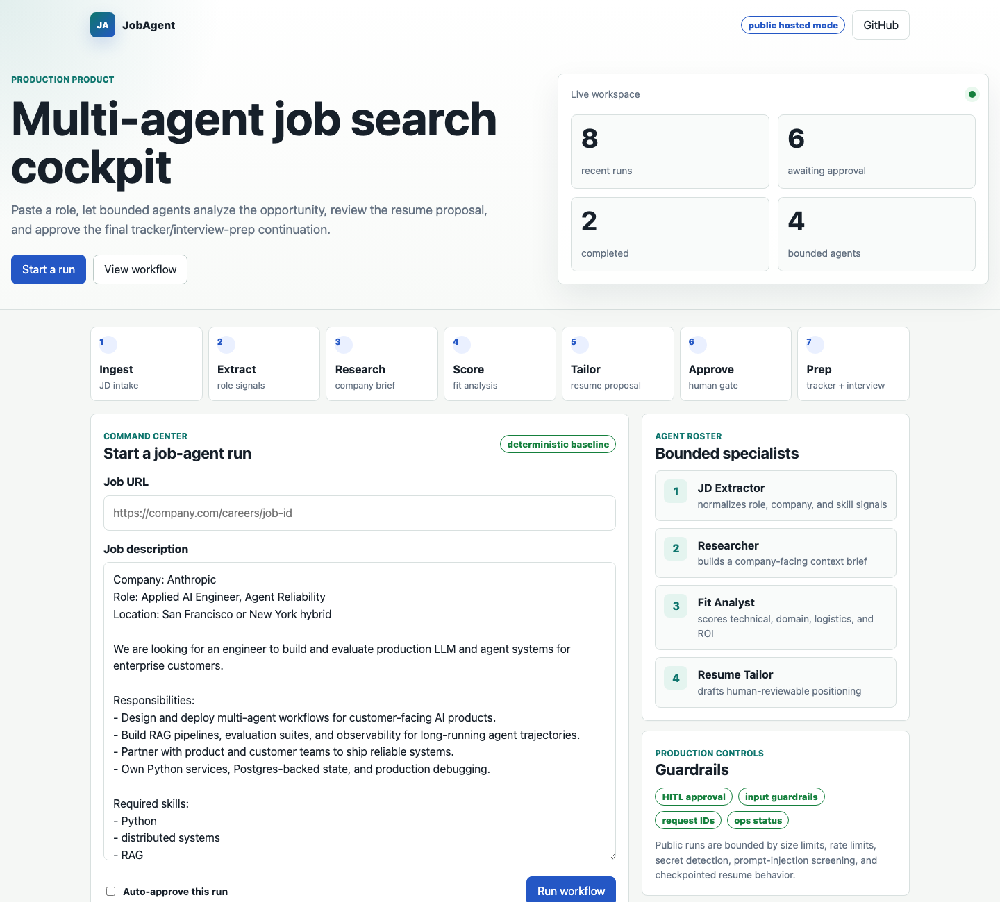
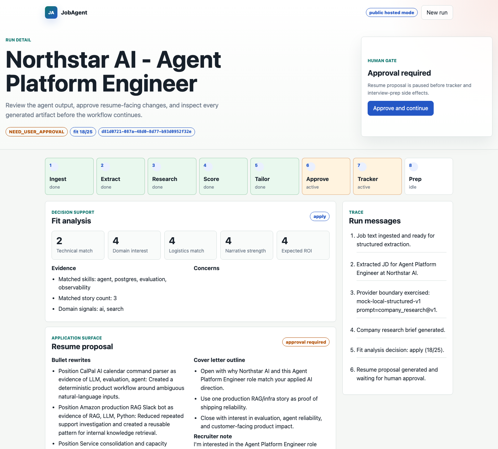
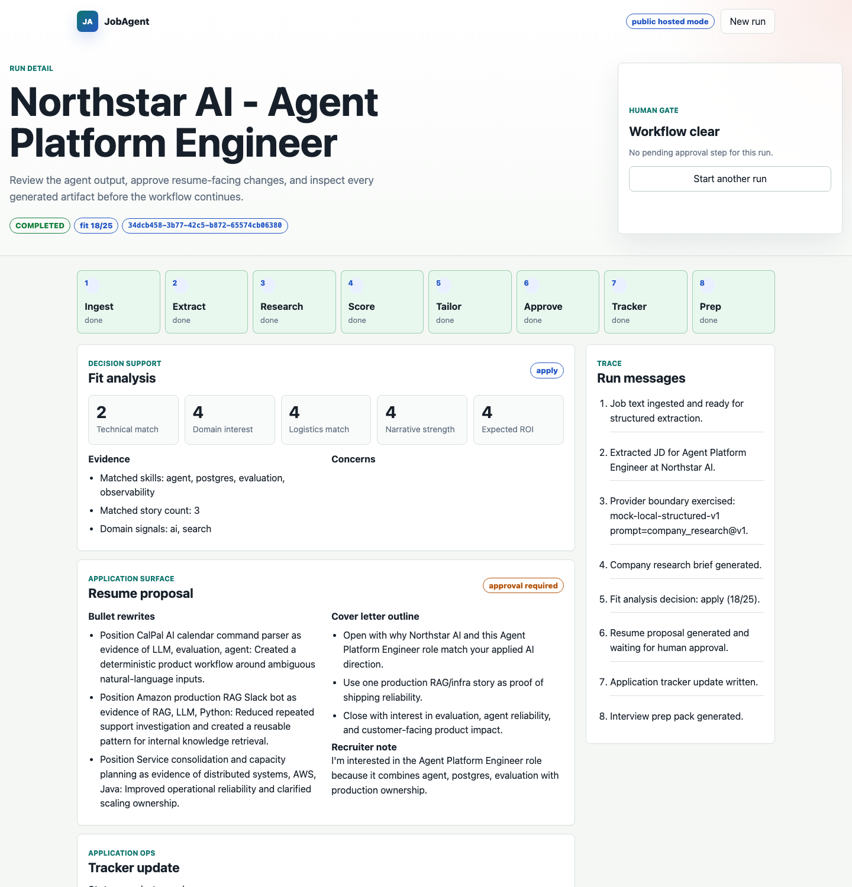
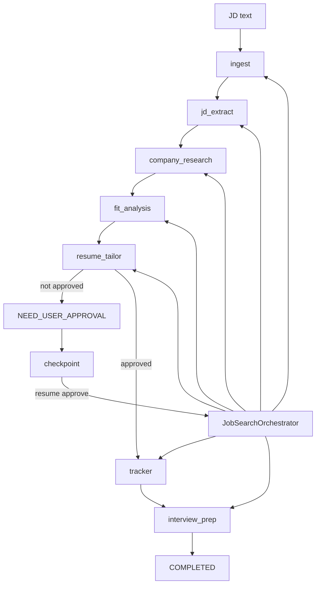

# Multi-Agent Job Search Platform

[English version](README.md)

这是一个可以直接使用的 agentic job-search product。它面向作品集展示和真实 demo 体验，但不是只停留在 architecture diagram 上，而是已经部署成一个可以打开、可以提交 JD、可以看到 agent workflow 结果的线上产品。

默认路径刻意保持 deterministic 和 low-cost：不需要 API key，不需要托管向量数据库，也不依赖脆弱的外部调用。先把 multi-agent production pattern 看清楚，再逐步替换成 LangGraph、LLM providers、MCP tools、Langfuse、Postgres 或 pgvector。

**线上产品:** [https://jobagent-demo.onrender.com](https://jobagent-demo.onrender.com)

## 产品叙事

JobAgent 同时服务两类读者：一类是真正想把求职准备流程跑顺的 job seeker，另一类是想看懂 agent 系统如何产品化的工程师。用户痛点不是“再来一个聊天框”，而是求职任务本身跨越很多风险边界：从 JD 抽取 role signals、判断简历叙事是否可信、保留证据，到任何 application-facing 输出生效前都必须让人审批。

所以这个产品故意做成 workflow cockpit，而不是开放式聊天 UI。后端继续拥有 state、approval、checkpoint、trace 和 eval 的权威；web layer 负责把这些系统决策展示成用户能理解、能操作的界面。当前 React/TypeScript frontend 也延续这个边界：交互 cockpit 放在 `jobagent/web/frontend/*`，build 后的 assets 从 `jobagent/web/static/assets/*` 提供，Jinja templates 收缩成 React mount points。

什么叫“好”，由 eval 定义，而不是由某一次生成文本看起来顺不顺来定义。一个 run 应该到达预期 trajectory 和 `StopReason`，抽取正确 JD signals，保留 human approval gate，让 retrieval evidence 可检查，并生成 UI 所需的关键 artifacts。workflow eval、retrieval eval 和 per-run quality summary 共同回答这个系统有没有退化。

## 产品截图



这个 hosted product 现在更像一个现代 typed job-search cockpit：状态卡、agent workflow strip、bounded specialist roster、recent activity、approval state、eval summary 和 command form 都放在一个聚焦的操作面里。核心闭环仍然保持简单：

1. 粘贴职位描述。
2. 让 bounded agent nodes 分析职位。
3. 在 application-facing 输出最终生效前暂停。
4. 人工确认 resume proposal。
5. 继续生成 tracker 和 interview-prep 输出。





## 这个项目在展示什么

- **Production-style orchestration:** control-plane orchestrator 会在每个 bounded agent node 执行前记录路由决策。
- **Typed shared state:** 所有 agents 读写同一个 `JobSearchState` model。
- **Human-in-the-loop control:** resume/application 输出会停在 `NEED_USER_APPROVAL`。
- **Checkpoint and resume:** 暂停后的 run 可以在人工确认后继续。
- **Offline and per-run evaluation:** deterministic eval cases 保护 workflow，每次 run 也会生成 quality summary。
- **Traceability:** 每次 run 都写出 JSONL traces，并在 UI 里展示 orchestrator decisions 和 tool audit events。
- **Typed product frontend:** React/TypeScript cockpit 负责前端交互状态、timeline、approval controls、eval summary 和 responsive UI。
- **Production surface:** FastAPI web app、React assets、Dockerfile、Render deployment、安全限制，以及 optional Postgres store。
- **Extensible stack:** 本地 deterministic runtime 可以逐步替换或扩展到 LangGraph、MCP、Langfuse、pgvector 和 hosted LLM providers。

## 本地运行

运行 workflow，并停在 resume proposal 的人工确认点：

```bash
python3 -m jobagent.cli demo
```

确认 proposal 后继续一个 paused run：

```bash
python3 -m jobagent.cli resume <run_id> --approve
```

运行完整 workflow，并写入本地 tracker event：

```bash
python3 -m jobagent.cli demo --auto-approve
```

运行 offline evals：

```bash
python3 -m jobagent.cli eval
```

运行测试：

```bash
python3 -m unittest discover -s tests
```

本地启动 web product：

```bash
uvicorn jobagent.web.app:app --reload
```

然后打开 <http://localhost:8000>。

## Render 部署

这个 repo 包含 Render Blueprint：[render.yaml](render.yaml)。当前 hosted product 在 Render free web plan 上部署一个 Docker web service：

- `jobagent-demo`: 运行 `uvicorn jobagent.web.app:app`
- health check: `/healthz`
- public hosted mode flag: `JOBAGENT_PUBLIC_DEMO_MODE=true`

[Deploy to Render](https://render.com/deploy?repo=https://github.com/yanxuantong/multi-agent-job-search-platform)

当前 Render product 不默认创建 managed Postgres，这样可以先上线展示，不被 billing/payment info 卡住。在这个模式下，run state 使用 web instance 内的 local checkpoint store，应该视为 ephemeral。之后如果要更接近 production，可以添加 Render Postgres，并把 `JOBAGENT_DATABASE_URL` 设置成 private connection string；app 会自动切换到 Postgres run store。

## Production Safety

公开服务已经做了基础限制：

- request body 和 job description 有明确大小上限
- `/runs` 有轻量 per-client rate limit
- public submission 在执行 workflow 前会先经过 secret 和 prompt-injection guardrails
- run id 在读取 checkpoint store 前会先做格式校验
- form submission 只接受 `application/x-www-form-urlencoded`
- response 包含基础浏览器安全头：CSP、frame protection、no-sniff、referrer policy、permissions policy
- 每个 response 都带 `X-Request-ID`，并提供 `/readyz` 和 `/ops/status` 做 production smoke check
- `/ops/evals` 会运行内置 regression suite，并返回 pass rate 和 failure categories
- 默认 workflow 不调用外部 LLM API，不执行用户代码，也不会 fetch 任意 job URL

这些控制并不意味着 free hosted instance 已经是 high-availability SaaS。它现在适合 portfolio/public traffic，同时保留清晰升级路径：auth、durable Postgres state、queue-backed workers、edge rate limiting 和 abuse monitoring。

## Production Hardening Notes

这一轮打磨刻意吸收了主流 agent/workflow 系统里的几个模式：

- **Durable execution mindset:** 每次 run 都 checkpoint；人工审批后从 pending node resume，而不是重放整个 workflow。
- **Control plane before agency:** `JobSearchOrchestrator` 会在每个 node 前决定 run、stop 或 ask human。
- **Tool boundary audit:** 每个 node 都映射到一个注册过的 tool capability，并记录 input summary、output summary、status、latency 和 cost estimate。
- **Guardrails before agency:** 明显 secrets、credential-shaped payloads、instruction-override prompt 会在任何 agent node 执行前被拒绝。
- **Operational visibility:** 暴露 `/healthz`、`/readyz`、`/ops/status`、`/ops/evals`、request ids、轻量 counters，以及 run detail trace table，方便 smoke test 和 incident triage。
- **Bounded public surface:** 默认 workflow 保持 deterministic、同步、零 token 成本；等 auth、queue、durable Postgres、budget tracking 到位后再接真实 LLM。

## 架构



## 怎么读代码

建议从 core workflow 开始：

- [jobagent/models.py](jobagent/models.py): shared state、artifacts 和 `StopReason`。
- [jobagent/graph/engine.py](jobagent/graph/engine.py): 小型 graph runner，对应 LangGraph 的 mental model。
- [jobagent/graph/workflow.py](jobagent/graph/workflow.py): node wiring 和 resume behavior。
- [jobagent/orchestration/controller.py](jobagent/orchestration/controller.py): control-plane routing、budget checks 和 HITL decisions。
- [jobagent/tools/registry.py](jobagent/tools/registry.py): registered tool boundaries 和 audit event creation。
- [jobagent/agents/](jobagent/agents): bounded agent responsibilities。
- [jobagent/storage/checkpoint.py](jobagent/storage/checkpoint.py): local checkpoint/resume store。
- [jobagent/web/app.py](jobagent/web/app.py): FastAPI production web surface 和安全控制。
- [jobagent/web/store.py](jobagent/web/store.py): local 或 Postgres-backed web run store。
- [jobagent/web/frontend/main.tsx](jobagent/web/frontend/main.tsx): React/TypeScript cockpit，负责首页、run detail、approval gate、eval summary 和 timeline。
- [jobagent/web/frontend/styles.css](jobagent/web/frontend/styles.css): responsive product UI styling。
- [jobagent/evals/runner.py](jobagent/evals/runner.py): offline eval harness。
- [jobagent/evals/run_quality.py](jobagent/evals/run_quality.py): product UI 使用的 per-run quality gate。
- [jobagent/retrieval/local_rag.py](jobagent/retrieval/local_rag.py): 带 citation 与 freshness metadata 的本地 RAG context assembly。
- [jobagent/retrieval/eval_runner.py](jobagent/retrieval/eval_runner.py): 先测 retrieval 命中的 RAG eval，再逐步走向 final-answer eval。
- [mcp_server/career_research_server.py](mcp_server/career_research_server.py): dependency-free MCP-shaped teaching stub。

本地 runtime artifacts 会写到 `.jobagent/`，并被 git ignore：

- `.jobagent/checkpoints/<run_id>.json`
- `.jobagent/runs/<run_id>/trace.jsonl`
- `.jobagent/applications.jsonl`

## Optional Production-Stack Paths

| Stack item | Code entrypoint | Install hint | Cost note |
| --- | --- | --- | --- |
| Local RAG | `jobagent/retrieval/local_rag.py`, `jobagent/retrieval/eval_runner.py` | Built in；运行 `python3 -m jobagent.cli retrieval-eval` | Local keyword retrieval 免费；hosted embeddings/rerankers 可能收费。 |
| LangGraph | `jobagent/graph/langgraph_reference.py` | `python3 -m pip install -e '.[langgraph]'` | Local library 免费；production checkpointers 可能需要 Postgres。 |
| Claude/OpenAI SDKs | `jobagent/llm/anthropic_provider.py`, `jobagent/llm/openai_provider.py` | `python3 -m pip install -e '.[llm]'` | API usage 通常按 token 计费。 |
| Langfuse | `jobagent/observability/langfuse_exporter.py` | `python3 -m pip install -e '.[observability]'` | Self-host 可以免费；hosted tiers 可能收费。 |
| Postgres/pgvector | `jobagent/storage/postgres_memory.py`, `docker-compose.yml` | `docker compose up postgres -d` | Local Docker 免费；managed databases 收费。 |
| External MCP consumer | `jobagent/integrations/external_mcp_tracker.py` | 选择 Notion 或 Sheets MCP credentials 后连接 | Workspace features 可能收费。 |
| MCP SDK server | `mcp_server/career_research_sdk_server.py` | `python3 -m pip install -e '.[mcp]'` | SDK 免费；connected tools 可能有 API costs。 |
| Docker | `Dockerfile`, `docker-compose.yml` | `docker compose run --rm app` | Local Docker 免费；cloud deploy 可能需要 billing。 |
