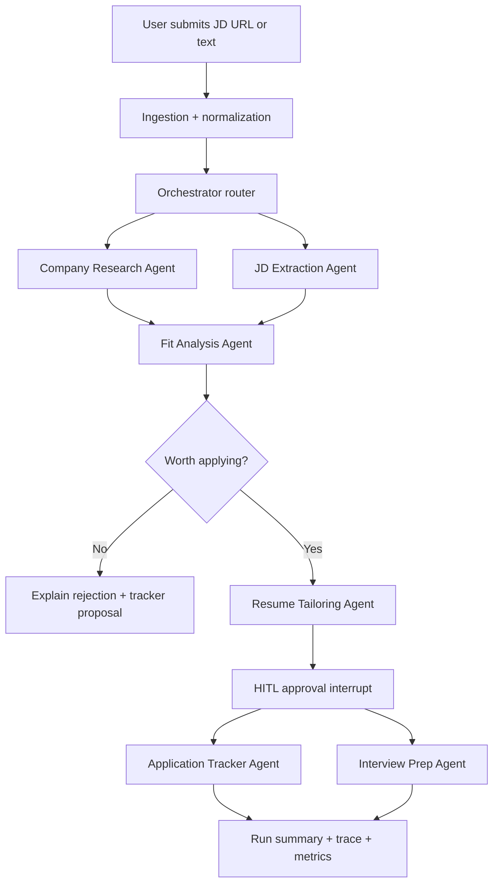

# Multi-Agent Job Search Platform - Technical Design Plan

## 1. Goal

Build a portfolio-grade multi-agent system that helps one user run a higher-quality job search:

- Research a company and job description.
- Decide whether the role is worth applying to.
- Tailor resume bullets and cover-letter/story angles.
- Track application state.
- Generate interview prep from the same research and personal story bank.
- Prove quality through evals, traces, metrics, and a small deployed demo.

The point is not to automate every job application. The point is to build a system you can deep-dive in interviews as evidence of applied AI engineering, agent orchestration, MCP/tooling, evaluation, observability, HITL, and deployment discipline.

## 2. Recommended Scope

### MVP workflow

Input:

- Job URL or pasted job description.
- Optional company URL.
- Target resume version or personal story-bank tags.

Output:

- Company brief.
- JD requirements extraction.
- Fit score with evidence.
- Resume bullet recommendations.
- Cover-letter/story outline.
- Application tracker update proposal.
- Interview prep pack.

Human approval is required before:

- Any outbound application material is considered final.
- Any tracker write happens.
- Any browser-like automation beyond read-only retrieval happens.

### Explicit non-goals

- No auto-apply bot in v1.
- No LinkedIn scraping or credentialed browser automation in v1.
- No complex SaaS UI in v1.
- No team/collaboration accounts in v1.
- No fine-tuning.

The first version should be CLI/API-first with trace dashboards and a simple local or minimal web UI only if needed for demos.

## 3. Architecture

Use a supervisor/orchestrator graph with deterministic state transitions. Let agents do bounded cognition inside graph nodes; let the graph own control flow, persistence, interrupts, retries, and stop reasons.



### Why this shape

- LangGraph is the orchestration spine because the workflow has state, retries, branching, HITL, and resumability.
- Agent SDKs or raw model SDK calls live inside nodes, not as the top-level controller.
- MCP is used for tools and external integrations, not as the app architecture.
- Langfuse/OpenTelemetry-style traces are mandatory from day one because eval/debuggability is part of the project value.

## 4. Tech Stack

### Core

- Language: Python.
- Package/runtime: `uv`.
- Orchestration: LangGraph.
- LLM layer: start with direct Anthropic SDK calls for key nodes; optionally wrap selected nodes with Claude Code SDK when its tool/session model is useful.
- Secondary comparison path: one small OpenAI Agents SDK prototype or design note for handoffs/guardrails, but do not split the main build.
- Structured outputs: Pydantic models plus JSON schema validation.
- Storage: Postgres + pgvector.
- Observability/evals: Langfuse.
- API: FastAPI only if a demo endpoint becomes useful.
- CLI: Typer or Click.
- Deployment: Docker Compose locally; Render/Fly.io/Modal for one public demo.

### MCP

Use MCP in two ways:

- Consume one external MCP integration for tracker/docs, such as Notion or Google Drive, if credentials are easy.
- Build one local MCP server named `career-research` exposing `research_company`, `extract_jd`, and `generate_interview_pack`.

If external MCP auth becomes slow, keep v1 tracker writes to local Postgres/CSV and still build the custom MCP server. Owning one server is more interview-valuable than spending three days fighting OAuth.

## 5. Agent Inventory

### Orchestrator

Responsibilities:

- Own graph state.
- Decide which node runs next.
- Enforce budget limits.
- Convert failures into typed stop reasons.
- Avoid letting one LLM recursively manage everything.

Inputs:

- `JobSearchState`.

Outputs:

- Next node name, stop reason, or interrupt request.

### Ingestion Agent or deterministic parser

Responsibilities:

- Fetch URL if safe and allowed.
- Parse JD text.
- Normalize company name, role title, location, seniority, salary, visa hints, tech stack.

Use deterministic extraction first, LLM second. This gives you cleaner evals.

### Company Research Agent

Responsibilities:

- Create a sourced company brief.
- Pull official website, careers page, recent news, funding/product notes when available.
- Identify AI relevance, business model, risks, and interview talking points.

Output schema:

- `company_summary`
- `product_lines`
- `business_model`
- `recent_signals`
- `engineering_relevance`
- `risks`
- `sources`

### JD Extraction Agent

Responsibilities:

- Extract role requirements into structured fields.
- Distinguish must-have vs nice-to-have.
- Identify interview themes.

Output schema:

- `responsibilities`
- `required_skills`
- `preferred_skills`
- `domain_signals`
- `seniority_signals`
- `visa_remote_location_signals`
- `unknowns`

### Fit Analysis Agent

Responsibilities:

- Compare JD/company signals against your story bank.
- Produce an evidence-based fit score.
- Decide whether to continue, skip, or require human review.

Scoring:

- Technical match: 0-5.
- Domain/company interest: 0-5.
- Immigration/location compatibility: 0-5.
- Narrative strength: 0-5.
- Expected ROI: 0-5.

### Resume Tailoring Agent

Responsibilities:

- Suggest resume bullet rewrites.
- Map story-bank evidence to JD requirements.
- Produce cover-letter outline or recruiter message.

This agent must always stop for human review. It should not overwrite resumes automatically in v1.

### Application Tracker Agent

Responsibilities:

- Write application state after approval.
- Track company, role, URL, status, next action, due date, source, fit score, and notes.

Start with Postgres and export to CSV. Add Notion/Google Sheets MCP only after the core tracker works.

### Interview Prep Agent

Responsibilities:

- Generate likely technical, behavioral, and company-specific questions.
- Match each question to personal stories.
- Produce a concise prep doc.

This is high demo value because it reuses all prior artifacts.

### Evaluator/Critic Agent

Responsibilities:

- Grade outputs against rubrics.
- Check source grounding.
- Check missing required sections.
- Flag hallucinated facts.

Use this as an offline eval judge first. Add online self-critique only after you have baseline eval numbers.

## 6. State Model

```python
class JobSearchState(BaseModel):
    run_id: str
    user_goal: str
    job_url: str | None
    raw_job_text: str | None
    company_name: str | None
    role_title: str | None
    normalized_jd: JDExtract | None
    company_brief: CompanyBrief | None
    fit_analysis: FitAnalysis | None
    resume_proposal: ResumeProposal | None
    tracker_update: TrackerUpdate | None
    interview_pack: InterviewPack | None
    sources: list[Source]
    messages: list[MessageRef]
    budget: RunBudget
    errors: list[AgentError]
    stop_reason: StopReason | None
```

```python
class StopReason(StrEnum):
    COMPLETED = "COMPLETED"
    NEED_USER_APPROVAL = "NEED_USER_APPROVAL"
    NEED_MORE_INPUT = "NEED_MORE_INPUT"
    TOOL_ERROR = "TOOL_ERROR"
    BUDGET_EXCEEDED = "BUDGET_EXCEEDED"
    LOW_CONFIDENCE = "LOW_CONFIDENCE"
    UNSAFE_OR_DISALLOWED_ACTION = "UNSAFE_OR_DISALLOWED_ACTION"
```

## 7. Persistence And Memory

### Operational tables

- `runs`: one orchestration run.
- `jobs`: normalized job/company records.
- `applications`: tracker state.
- `artifacts`: generated briefs, resume proposals, interview packs.
- `traces`: external trace IDs, cost, latency, model.
- `eval_runs`: eval execution metadata.
- `eval_results`: per-case scores and failure reasons.

### Memory tables

- `story_bank`: Amazon/project/personal stories, tagged by skill, scope, impact, conflict, leadership, AI/infra relevance.
- `preferences`: target roles, locations, company filters, visa constraints, compensation ranges.
- `semantic_memory`: embeddings for reusable personal context and company notes.
- `episodic_memory`: prior applications and outcomes.

Do not put all memory into vector search. Use relational filters first, vector recall second.

## 8. Control Flow Details

### Main command

```bash
uv run jobagent run --job-url <url> --goal "decide_apply_and_prepare"
```

### Eval command

```bash
uv run jobagent eval --suite company_research_v1
```

### Demo command

```bash
uv run jobagent demo --job-url <url>
```

### HITL behavior

The graph interrupts with a JSON payload:

```json
{
  "reason": "NEED_USER_APPROVAL",
  "artifact_type": "resume_proposal",
  "summary": "3 bullet rewrites and 1 recruiter note are ready.",
  "options": ["approve", "edit", "reject"]
}
```

On resume, the user decision becomes part of state and trace metadata.

## 9. Evaluation Plan

Evaluation is the biggest portfolio differentiator. Build it before optimizing.

### Eval suites

1. JD extraction evals: 20 examples.
2. Company research evals: 15 examples.
3. Fit scoring evals: 15 examples.
4. Resume tailoring evals: 10 examples.
5. End-to-end trajectory evals: 8 examples.

### Metrics

- Schema validity rate.
- Required-field completeness.
- Source-grounding score.
- Hallucination count.
- Fit-score calibration against human labels.
- Human approval rate.
- Token cost per successful run.
- p50/p95/p99 latency.
- Retry rate and stop-reason distribution.

### Grading strategy

- Code-based checks for schema, required fields, source URL presence, and exact constraints.
- LLM judge for nuanced quality with a strict rubric.
- Human labels for the final 10-20 golden cases.

### Target numbers for README

Do not invent these. Measure them.

- Baseline pass rate before reranking or prompt changes.
- Pass rate after one improvement.
- Average token cost before/after context compression.
- p95 latency for the full workflow.
- Number of real applications processed.

## 10. Observability

Every run should emit:

- `run_id`
- user goal
- graph node timings
- model name
- prompt version
- input/output tokens
- estimated cost
- tool calls
- source URLs
- retry count
- stop reason
- eval score if applicable

Dashboards:

- Workflow success rate by stop reason.
- Cost and latency by agent.
- Eval pass rate over time.
- Top failure categories.

## 11. Security, Privacy, And Policy Boundaries

- Store API keys in environment variables or a secret manager.
- Redact resume, phone, email, address, immigration details, and personal story-bank text from public traces.
- Keep a `public_demo_mode` that uses synthetic story-bank data.
- Do not automate applications or send emails without explicit approval.
- Avoid scraping credentialed job sites. Prefer pasted JD text, official careers URLs, public job pages, or user-provided exports.
- Add `robots` and terms-of-service notes to README if web retrieval is included.

## 12. Repo Shape

```text
jobagent/
  app/
    cli.py
    config.py
    graph/
      state.py
      orchestrator.py
      nodes/
    agents/
      company_research.py
      jd_extract.py
      fit_analysis.py
      resume_tailor.py
      interview_prep.py
      evaluator.py
    tools/
      web_fetch.py
      tracker.py
      mcp_client.py
    memory/
      store.py
      schemas.py
    observability/
      tracing.py
      metrics.py
  mcp_server/
    career_research_server.py
  evals/
    datasets/
    rubrics/
    runner.py
  tests/
  docker-compose.yml
  README.md
```

## 13. Four-Week Implementation Plan

### Week 1: spine, one real agent, tracing

Deliverables:

- `uv` project skeleton.
- LangGraph state machine with ingestion, JD extraction, company research, and terminal summary.
- Pydantic output schemas.
- Langfuse tracing for every node.
- 5 seed eval cases.
- One demo run from JD text to structured company/JD brief.

Success check:

- You can run one command, get a structured output, and open a trace showing every model/tool call.

### Week 2: multi-agent workflow, memory, HITL

Deliverables:

- Fit Analysis Agent.
- Resume Tailoring Agent.
- HITL interrupt/resume flow.
- Postgres application tracker.
- Story-bank schema and first 10 personal stories.
- 15-20 eval cases.

Success check:

- The workflow can pause before resume suggestions are accepted and resume cleanly after approval/edit/reject.

### Week 3: eval depth, MCP, deployment

Deliverables:

- Full eval runner.
- RAG/retrieval experiment if needed.
- Custom `career-research` MCP server.
- Docker Compose with Postgres and app.
- Minimal deployed demo or recorded local demo.
- README with architecture diagram and measured numbers.

Success check:

- You have at least one before/after improvement backed by eval numbers.

### Week 4: portfolio packaging and FDE story

Deliverables:

- 3-minute demo video.
- 15-minute interview walkthrough.
- Technical blog draft.
- Resume bullets with measured outcomes.
- Design tradeoff notes: LangGraph vs OpenAI Agents SDK vs direct SDK; MCP vs direct API; vector memory vs relational memory.
- Public demo mode with synthetic data.

Success check:

- You can answer: "How do you know your agent works?", "How do you handle failure?", and "Why this architecture?" using code, traces, evals, and measured numbers.

## 14. Build Order

1. Define schemas and stop reasons.
2. Build deterministic ingestion and JD extraction.
3. Add one LLM company-research node.
4. Add tracing.
5. Add eval runner with 5 cases.
6. Add fit analysis.
7. Add HITL resume proposal.
8. Add tracker persistence.
9. Add story-bank memory.
10. Add interview prep.
11. Add custom MCP server.
12. Dockerize and package demo.

## 15. Key Tradeoffs To Be Ready To Explain

- LangGraph over pure agent SDK: explicit state, checkpointing, HITL, retries, and graph-level observability.
- Direct SDK calls inside nodes: less framework magic, easier to debug, easier to discuss in interviews.
- MCP only at integration boundaries: good protocol signal without turning the whole app into protocol ceremony.
- CLI-first over UI-first: project value is agent architecture and eval, not frontend polish.
- Human approval over auto-apply: safer, more realistic, and better aligned with trustworthy agent design.
- Relational memory plus vector memory: structured constraints should not be approximated by embeddings.

## 16. Interview Narrative

Short version:

> I built a multi-agent job-search platform because I was the user. The system takes a JD, researches the company, extracts requirements, scores fit against my story bank, proposes tailored resume/interview prep, and tracks the application. The important part is not that it uses agents; the important part is that I treated agents as production software: typed state, stop reasons, HITL approval, eval suites, tracing, cost/latency budgets, and a custom MCP server.

What to demo:

1. One end-to-end run.
2. One Langfuse trace.
3. One eval report.
4. One failed run handled cleanly.
5. One MCP call from another client.

